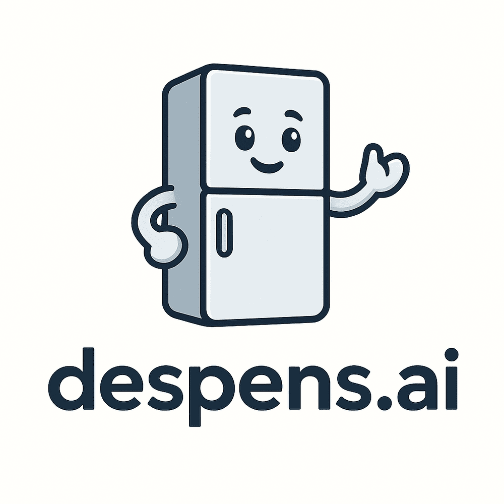
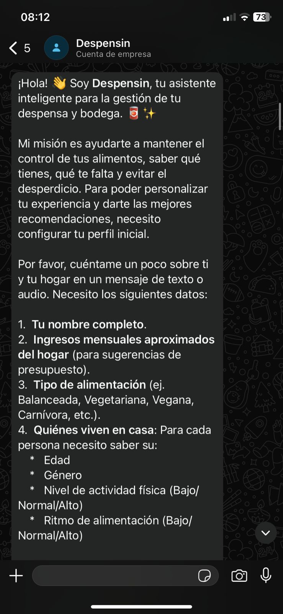
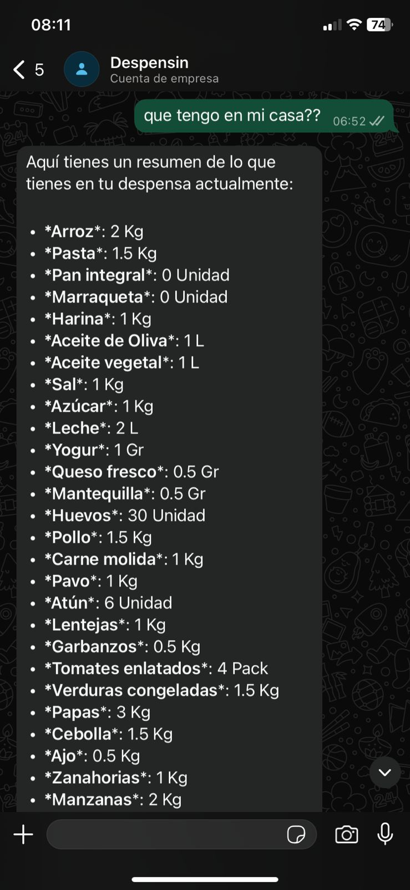
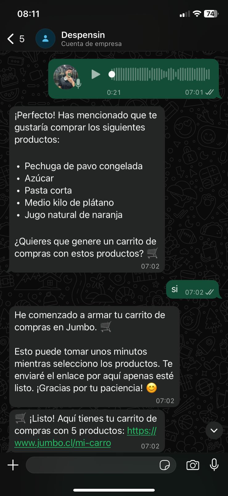
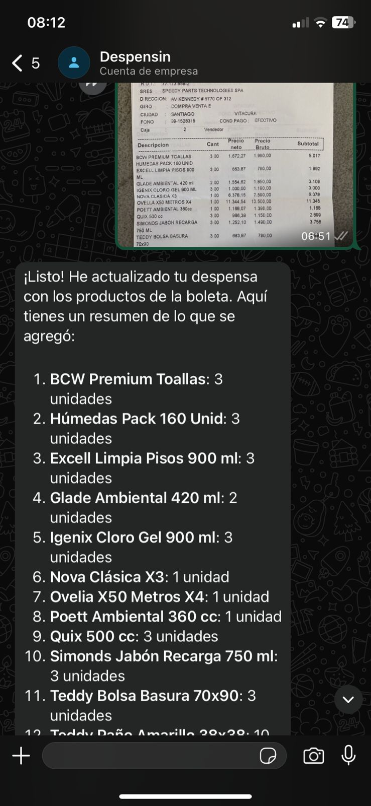
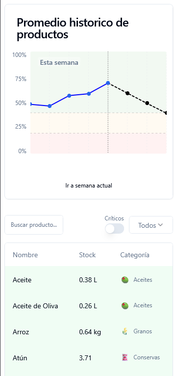
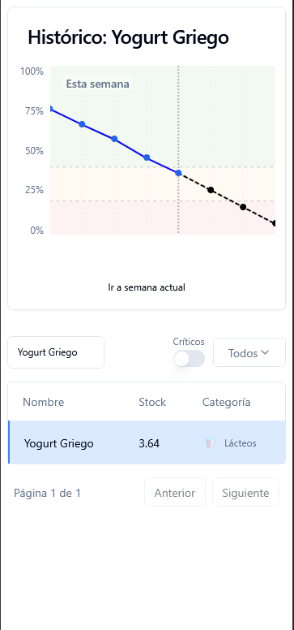

# Despens.ai 🥫✨

**Current project logo:** project-logo.png

**Track**: ✨ consumer AI

despens.ai es un bot de WhatsApp inteligente que ayuda a las personas a mantener un control completo del inventario de sus despensas domésticas. Utilizando modelos de lenguaje (LLMs), inteligencia artificial y técnicas de predicción, el sistema genera estimaciones precisas del stock de cada producto.

Los usuarios interactúan con **Despensin**, un gestor de despensas amigable y motivado cuyo propósito principal es conocer el estado de cada producto y asegurarse de que nunca más se olvide comprar algo en el supermercado.

---

### 1. Onboarding Personalizado

Todo comienza en WhatsApp. Despensin inicia una conversación amigable para conocer tu hogar y configurar tu perfil inicial.

### 2. Control Total de tu Inventario

¿Dudas en el pasillo del súper? Pregúntale a Despensin qué tienes en casa y recibe un reporte instantáneo de tu stock actual.

### 3. Asistente de Compras Inteligente

Basado en tus necesidades, Despensin genera automáticamente un carrito de compras en tu supermercado favorito, listo para pagar.

### 4. Actualización sin Esfuerzo

Olvídate de ingresar datos manualmente. Simplemente envía una foto de tu boleta y nuestra IA procesará cada ítem para actualizar tu despensa al instante.

### 5. Tu Despensa Visualizada

Accede a un dashboard web limpio y ordenado donde puedes ver el estado y resumen de tus productos.

### 6. Proyecciones y Consumo

Entiende tus hábitos con gráficos históricos que muestran tu consumo real y predicen cuándo necesitarás reabastecerte.

---

## Equipo 👨‍💻

**team-31**

- Nicolás Hörmann ([@NicoPuc](https://github.com/NicoPuc))
- Agustín Gallardo ([@agustin-gallardo](https://github.com/agustin-gallardo))
- Raimundo Mena ([@rmena1](https://github.com/rmena1))
- Gonzalo Perez ([@gonzaloperezreich](https://github.com/gonzaloperezreich))
